# Everybody's Recipes

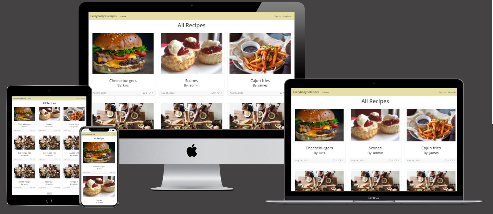

Everybody's Recipes is a recipes blog where users can share their recipes, as well as view and comment on other users' recipes. Create your own list of favourites and enjoy the world of food with others!

## UX

### Project Goals

- To create a recipe blog where users can view and create recipes, keep a list of the recipes they've created as well as other users' recipes they like, and interact with other site users by commenting on recipes. 

### User Stories

| Epic | User Story | Description |
| --- | --- | --- |
| Site Navigation | Site pagination | As a Site User I can view a paginated list of posts so that I can select a recipe to view |
| | View Recipes | As a Site User I can click on a post so that I can open a recipe page |
| | Filter Recipes | As a Site User I can filter recipes so that I can see the recipes which I created |
| Authenticated User | User Registration | As a Site User I can register so that I can add comments, likes and rate or favourite recipes |
| | Commenting | As a Site User I can comment on a recipe so that I can interact with other users |
| | Managing comments | As a Site User I can edit and delete my comments so that I can manage my contributions and interactions with other users |
| | Rating recipes | As a Site User I can rate a recipe so that I can contribute to rating recipes on the site |
| | Favourites | As a Site User I can select favourites so that I can easily view a list of my favourite recipes |
| | Create recipes | As a Site User I can create recipes so that I can share them with other users |
| | View star rating | As a Site User I can view the star rating so that I can see which recipes are the most popular |
| Site Administration | Manage content | As a Site Admin I can create, read, update and delete recipes so that I can manage my site content |
| | Control comments | As a Site Admin I can approve or disapprove comments so that I can filter out objectionable comments | 
| | Create draft recipes | As a Site Admin I can create draft recipes so that I can finish writing the content later |
| | Publish recipes | As a Site Admin I can view user submitted recipes so that I can approve and publish them to the site |

### Agile

The user stories were managed using the GitHub Projects kanban board.

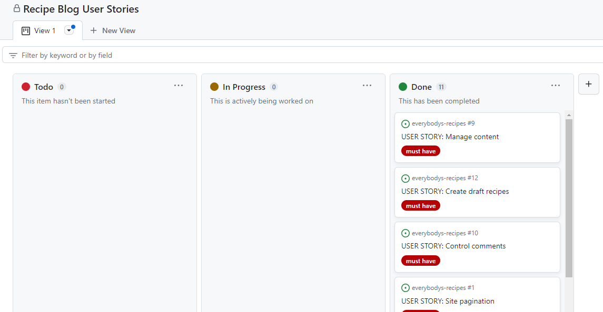

### Design

#### Wireframe

Wireframes of the home page and recipe page were created using Balsamiq.

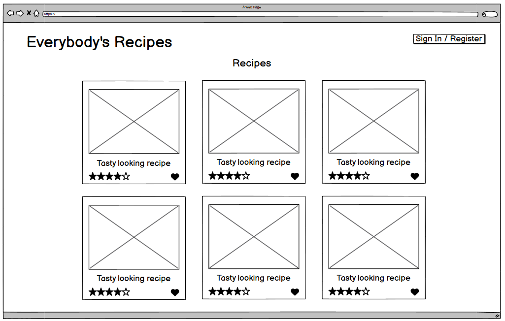

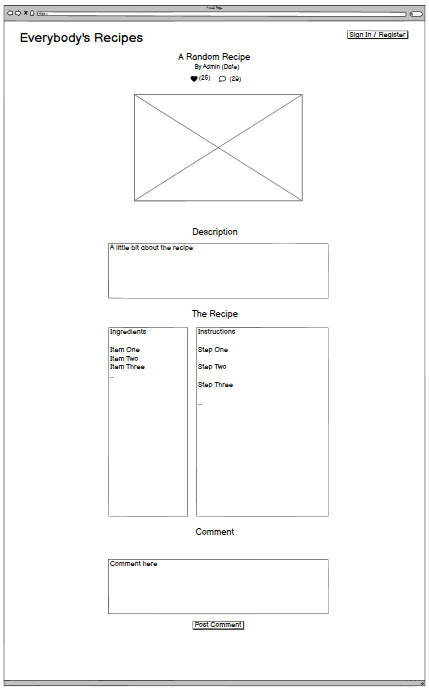

#### Database Model

| Model | Key | Name | Type | Notes |
| --- | --- | --- | --- | --- |
| Recipe Model | | Title (Unique) | Char | Max Length = 200 |
| | | Slug (Unique) | SlugField | Max Length = 200 |
| | ForeignKey | Author | User Model | |
| | | Date Created | DateTime | |
| | | Recipe Photo | CloudinaryField | |
| | | Description | TextField | |
| | | Ingredients | TextField | |
| | | Instructions | TextField | |
| | Many to Many | Favourited | User model | |
| | | Status | IntegerField | 0 = Draft, 1 = Published |

#### Styling

#### Typography

The default font for the site is Open Sans. This was selected mainly due to being optimised for print, web and mobile interfaces - important for a recipes blog as users have the option of printing a recipe for use in kitchen, but are equally likely to simply read the recipe from their mobile device.

#### Colour Scheme

As with the typography, the colour scheme was kept simple to give the user the option of either printing their recipe or viewing with their mobile device. For this reason the colour scheme is predominantly white background with black text, with minimal greys for buttons, borders, etc. The navbar is coloured in a pale primrose, to give a country kitchen type theme.

## Features

### Site Navigation

The navigation bar is a customised version of the responsive Bootstrap 5.3 navbar.

- Navbar when not signed in:

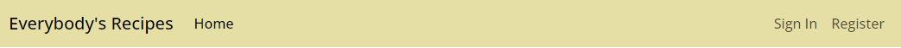

- Navbar when signed in:

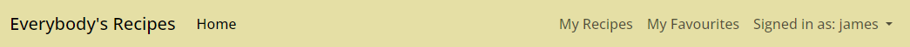

- Navbar dropdown when signed in:

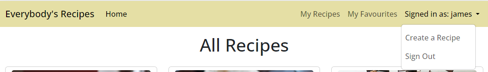

- Navbar collapsed for smaller screens:

- Navbar hamburger expanded for smaller screens:

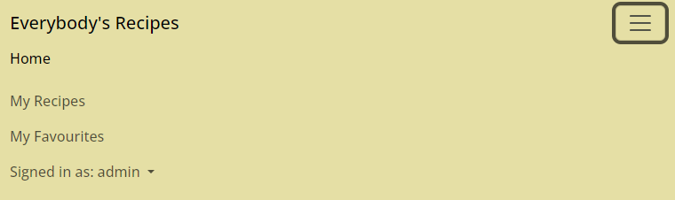

### User Registration

Users can register and login to the site for features such as creating recipes, commenting, interacting with others and favouriting recipes for later.

#### Sign Up

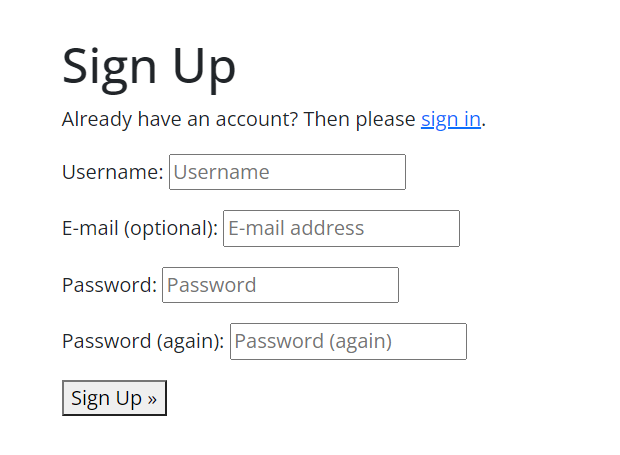

#### Sign In

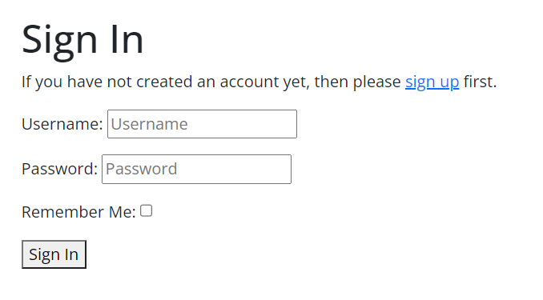

#### Sign Out

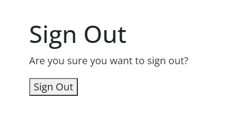

### CRUD Functionality

#### Comments - Create, Edit and Delete

Authenticated users can create comments on recipe pages and submit them to administrator for approval. They can also edit and delete their own comments, even if it has not yet been approved.

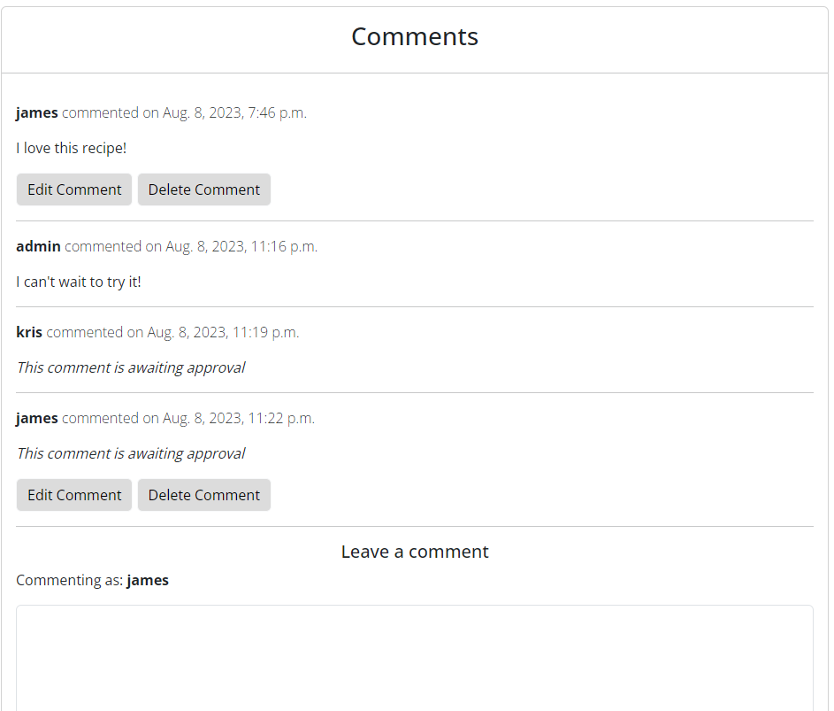

#### Creating Recipes

Authenticated users can create their own recipes and submit them to the administrator to be published to the site.

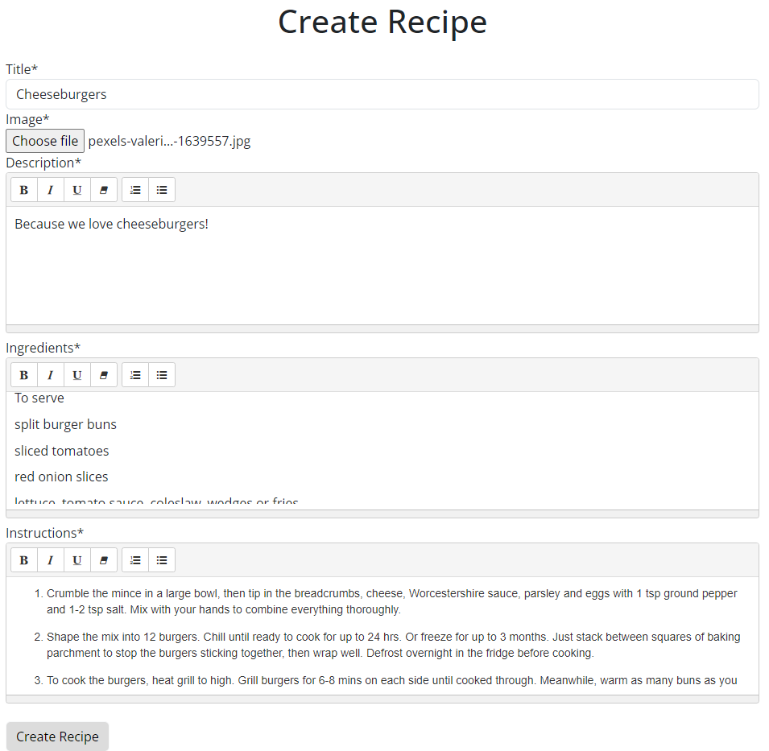

When the administrator publishes the recipe, it will appear on the homepage and in the recipe creator's My Recipes page.

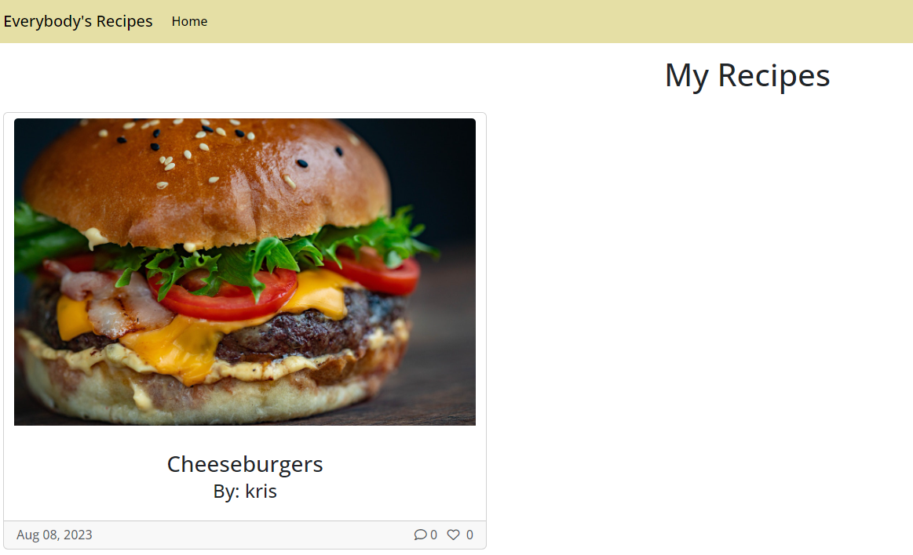

#### Favourites

Authenticated users can favourite recipes they like.

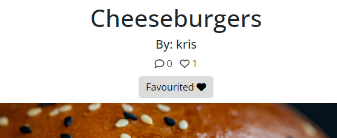

These will appear in the user's My Favourites page.

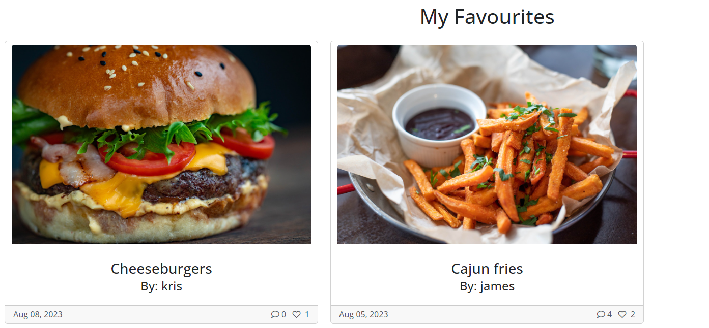

Unfavouriting the recipe will remove it from the user's My Favourites page.

### User Notifications

Messages such as the one below will appear to notify the user of various events.

These messages include:
- Successfully signed in as 'user'
- You have signed out
- Your comment is awaiting approval
- Your comment has been edited and is awaiting approval
- Your comment has been deleted
- Your recipe has been uploaded and will be published by the administrator

### Features to be Implemented for Future

- It was originally intended for users to have the ability to rate recipes, and there to be an overall star rating for each recipe. This was considered a 'nice to have', but not essential, as the recipe favouriting system was already implemented. This has been documented on the Github Projects kanban board, and the issues associated with the star rating have been archived.

## Testing

### Manual Testing

Testing User Stories:

| User Story | Expectation | Outcome | Result |
| --- | --- | --- | --- |
| Site pagination | User can see a paginated list of recipes and can browse by scrolling and clicking the next/previous buttons at the bottom of the page | The recipe cards are visible on the front page. There are 6 per page and more pages can be accessed using the next/previous buttons at the bottom of each page | Pass |
| View recipes | User can open a recipe page from the paginated list of recipes | When a recipe is clicked the user is taken to the corresponding recipe page | Pass |
| User registration | User can sign in or register to gain access to creating, favouriting and commenting on recipes | When a user is not logged in, the navbar shows both a Sign In and Register button, which takes the user to the corresponding page where they can sign in or create an account. They are then returned to the home page and notified of a successful sign in or registration | Pass |
| Commenting | When signed in, the user can comment on recipes | If signed in, a text field is visible at the bottom of the recipe page where the user can leave a comment | Pass |
| Managing comments | User can edit and delete their own comments | When signed in, both an edit comment and delete comment button appear directly below any of the user's own comments. These take the user to the corresponding page where they can confirm editing or deletion of the comment | Pass |
| Favourites | User can access and view a list of recipes they have favourited | When the user is signed in, a favourites button appears on the navbar, which can be used to access a paginated list of recipes that they have favourited | Pass |
| Create recipes | User can create their own recipe and add it to the site to share with others | When signed in, the user can access the page to create recipes via the navbar. Here, the user can fill in fields for title, description, ingredients, instructions and upload an image. On saving, the new recipe is sent to the site administrator to be published to the site | Pass |
| Manage content | Site admin can create, read, update and delete recipes and manage site content | When signed in as an administrator, the admin page can be accessed to manage recipe content, ie. create, edit, delete and publish recipes to the site | Pass |
| Control comments | Site admin can approve or disapprove new and edited comments to filter out objectionable comments and manage commenting on recipe pages | When signed in as an administrator, the admin page can be accessed to manage all comments and review, set to approved, or delete comments as required  | Pass |
| Create draft recipes | Site admin can create draft recipes to be saved and completed at a later date | When signed in as an administrator, the admin page can be accessed to manage all recipes and edit fields, save for later and set to draft or published | Pass |

### Performance Testing

Performance testing was conducted using Google Lighthouse for the home page and recipe pages:

- Home page desktop

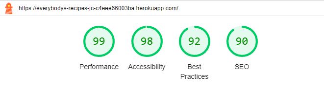

- Home page mobile

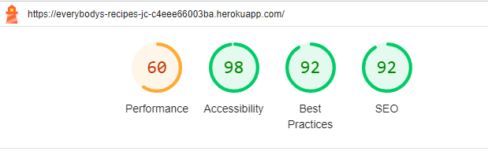

- Recipe page desktop

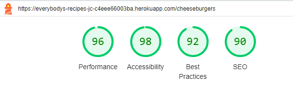

- Recipe page mobile

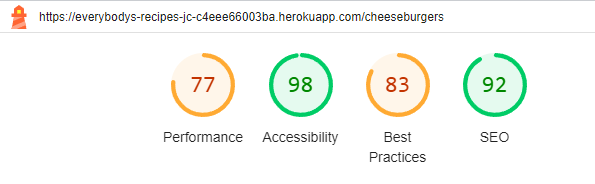

### Accessibility

Accessibilty testing was conducted for the home and recipe pages using the WAVE web accessibility evaluation tool. No errors returned:

- Home page

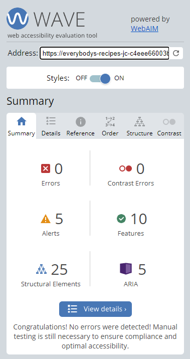

- Recipe page

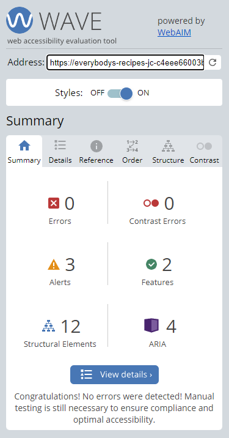

### Validation Testing

#### HTML

No errors returned when checking code with the official W3C validator.

- Homepage

- My Recipes

- Favourites

- Recipe Detail

The comment update, comment confirm delete and create recipe forms all returned an empty heading warning, even though each template contained a title within the block heading. However, as these were only warnings and not errors, they were dismissed.

- Comment Update Form

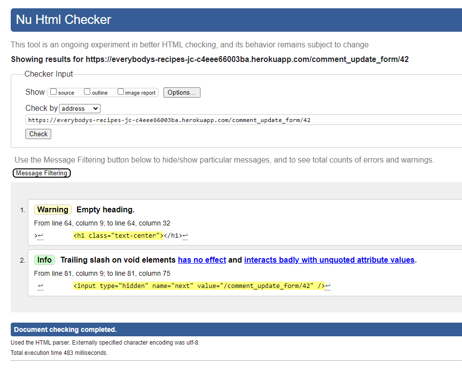

- Comment Confirm Delete Form

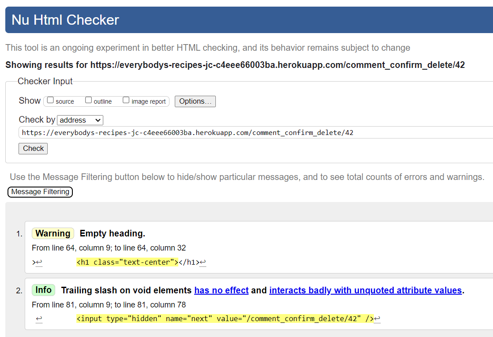

- Create Recipe Form

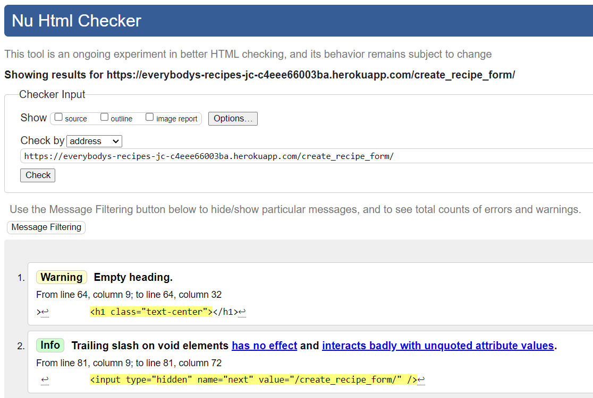

#### CSS

No errors returned when checking style.css in the W3C CSS validator.

#### Python

The python code was passed through the Code Institute PEP8 linter to confirm that there were no issues.

**Recipe blog app:**

- admin.py:

- apps.py:

- forms.py:

- models.py:

- urls.py:

- views.py:

**Everybody's Recipes project**

- asgi.py:

- settings.py:

settings.py returned some minor errors due to lines being longer than standard. As these were related to django auth password validators and cloudinary storage, they left as is.

- urls.py:

- wsgi.py:

#### Javascript

No errors returned when checking the JavaScript function in base.html:

### Bugs

| Bug | Description | Fix |
| --- | --- | --- |
| Image not loading from cloudinary | On the recipe_detail template, the image was not being loaded from cloudinary. It was confirmed that the image was being stored on cloudinary, but not being rendered in the template | Fixed by changing the image source from `{{ recipe.recipe_photo }}` to `{{ recipe.recipe_photo.url }}` |
| ModuleNotFoundError: No module named ‘cripsy_forms’ | Error after installing Django Crispy Forms | In the INSTALLED_APPS in settings.py, cri**s**py_forms was mistyped cri**p**sy_forms. Correcting the type fixed the issue |
| 'Comment waiting for approval' success message error | 'Comment waiting for approval' success message appears in the comments of a recipe page when user clicks on the favourite button on a recipe, instead of recipe being favourited and number of favourites incrementing | In the RecipeFavourite class, the post function was not defined properly, and was called recipe instead. The issue was fixed when properly defined as a post function |
| 'Body:' appears next to text field  | On the Edit comment form, the field label (Body:) appears next to the text field | Fixed by adding `labels = {'body': ""}` and `label_suffix = ''` to the Meta class in CommentForm and `{{ form.body }}` instead of `{{ form }}` in the comment_update_form template |
| TemplateDoesNotExist at /comment_confirm_delete/17 | When user attempts to delete a comment, an error is returned instead of being directed to the comment_confirm_delete template | Fixed by correcting template_name in the DeleteComment view from `'comment_confirm_delete'` to `'comment_confirm_delete.html'` |
| NoReverseMatch at /delete-comment/10 Reverse for 'recipe_detail with no arguments not found | Error when user attempts to delete a comment and return to the recipe page | Fixed by changing `reverse_lazy('recipe_detail')` to `reverse_lazy('recipe_detail', args=[recipe.slug])` |
| 'Comment' label in front of comment | On the Delete comment form, after 'Are you sure you want to delete the following comment?', the 'Comment' label appears before the comment being referred to | Fixed by changing `{{ comment }}` tp `{{ comment.body }}` on the comment_confirm_delete template |
| IntegrityError at /create_recipe_form/ null value in column "author_id" of relation "blog_recipe" violates not-null constraint | Error when user attempts to create a recipe using the create recipe form | The recipe was being submitted with an emtpy author field. To fix the error, the code `form.instance.author_id = request.user.id` was added to the post method in the CreateRecipe view |
| IntegrityError at /create_recipe_form/ duplicate key value violates unique constraint "blog_recipe_slug_key" DETAIL: Key (slug)=() already exists | Error when user attempts to create a recipe using the create recipe form | The recipe was being submitted with an empty slug field. This was fixed by adding `form.instance.slug = slugify(form.instance.title)` to slugify the submitted recipe title |
| Page not found (404) The current path, create_recipe_form/my_recipes.html, didn't match any of these | Error when user attempts to create a recipe using the create recipe form | When the recipe was submitted, the user was being redirected to a template relative to the create_recipe_form template, which doesn't exist. This was fixed by adding a / to the start of the success url, which redirected to the template relative to the root site |
| TypeError at /create_recipe_form/ clean() got an unexpected keyword argument 'styles' | Error when applying SummernoteTextField to fields in Recipe model to allow recipe creation for users. Error would appear when user attempts to create a recipe | This is an issue on the django-summernote github (#477), which was fixed by uninstalling version 6.0.0 of bleach and installing version 4.1.0 in its place |

## Deployment

This project was developed in GitHub and Gitpod from Code Institute's [gitpod template](https://github.com/Code-Institute-Org/gitpod-full-template), and has been deployed to Heroku. The process below requires an ElephantSQL database and Cloudinary storage.

The deployment process closely follows that of Code Institute's **'I Think Therefore I Blog'** walkthrough project and [Cheat Sheet](https://docs.google.com/document/d/1P5CWvS5cYalkQOLeQiijpSViDPogtKM7ZGyqK-yehhQ/edit#heading=h.5s9novsydyp1), and is as follows:

Gitpod Project
- Create a new workspace using the aforementioned [gitpod template](https://github.com/Code-Institute-Org/gitpod-full-template)
- Install Django: `pip3 install 'django<4' gunicorn`
- Install supporting libraries: `pip3 install dj_database_url==0.5.0 psycopg2`
- Install Cloudinary libraries: `pip3 install dj3-cloudinary-storage`
- Create requirements.txt file: `pip3 freeze --local > requirements.txt`
- Create project: `django-admin startproject PROJ_NAME .`
- Create app: `python3 manage.py startapp APP_NAME`
- In **settings.py**, add the app to **installed apps** and save file: 
`INSTALLED_APPS = [` 
&nbsp; &nbsp; &nbsp; &nbsp;`…` 
&nbsp; &nbsp; &nbsp; &nbsp;`'APP_NAME',` 
`]`
- Migrate changes: `python3 manage.py migrate`
- Run server to test: `python3 manage.py runserver`
- An error will be returned showing a disallowed hostname. Copy the hostname and add to **allowed hosts** in the **settings.py** file: 
`ALLOWED HOSTS = ['Add hostname here']`

ElephantSQL Database
- Login to ElephantSQL to access your dashboard
- Click 'Create New Instance'
- Set up a plan by selecting **Tiny Turtle (Free)** and entering a **Name** (typically the name of the project). Tags can be left blank
- Click 'Select Region' and select a data centre near you
- Click 'Review', confirm details are correct, then click 'Create Instance'
- From the ElephantSQL dashboard, click on the newly created database name
- Copy the database URL by clicking the adjacent copy icon

Create Heroku App
- Login to Heroku
- From the dashboard, create a new app
- Give the app a unique name and choose your region (United States or Europe)
- Click create app
- Go to the Settings tab
- Click Reveal Config Vars
- Add Config Var: 
KEY: DATABASE_URL | PORT: The database url copied from ElephantSQL (starting with postgres://)

Attach Database:
- Return to Gitpod file explorer and create a new **env.py** file in the top level directory
- In **env.py**, import os library: `import os`
- Set environment variables: `os.environ["DATABASE_URL"] = "ElephantSQL database URL"`
- Add secret key: `os.environ["SECRET_KEY"] = "User defined or generated secret key"`
- Return to Heroku App and add secret key to Config Vars: 
KEY: SECRET_KEY | PORT: "User defined or generated secret key" 

In **settings.py**:
- Reference env.py below `from pathlib import Path`: 
`import os` 
`import dj_database_url` 
`if os.path.isfile('env.py'):` 
 &nbsp; &nbsp; &nbsp; &nbsp;`import env`
- Replace SECRET_KEY with that matching the Heroku App: 
`SECRET_KEY = os.environ.get('SECRET_KEY')`
- Comment out the DATABASES section and add new database: 
`DATABASES = {` 
&nbsp; &nbsp; &nbsp; &nbsp;`'default': dj_database_url.parse(os.environ.get("DATABASE_URL"))` 
`}`
- Save all files and make migrations from the terminal: `python3 manage.py migrate`

Cloudinary
- Login to Cloudinary
- From the dashboard, copy the CLOUDINARY_URL (API Environment Variable) using the 'Copy to clipboard' link
- Add the copied link to **env.py**: `os.environ["CLOUDINARY_URL"] = "cloudinary://***"`

In Heroku:
- Add Config Vars: 
KEY: CLOUDINARY_URL | PORT: "cloudinary://***" 
KEY: DISABLE_COLLECTSTATIC | PORT: 1 **(remove before deployment)**  
KEY: PORT | PORT: 8000 

In **settings.py**:
- Add Cloudinary Libraries to installed apps section in the following order: 
`INSTALLED_APPS = [` 
&nbsp; &nbsp; &nbsp; &nbsp;`…` 
&nbsp; &nbsp; &nbsp; &nbsp;`'cloudinary_storage',` 
&nbsp; &nbsp; &nbsp; &nbsp;`'django.contrib.staticfiles',` 
&nbsp; &nbsp; &nbsp; &nbsp;`'cloudinary',` 
&nbsp; &nbsp; &nbsp; &nbsp;`…` 
`]`
- Tell Django to use Cloudinary to store media and static files (below `STATIC_URL = '/static/'`): 
`STATICFILES_STORAGE = 'cloudinary_storage.storage.StaticHashedCloudinaryStorage'` 
`STATICFILES_DIRS = [os.path.join(BASE_DIR, 'static'),]` 
`STATIC_ROOT = os.path.join(BASE_DIR, 'staticfiles')` 
 
`MEDIA_URL = '/media/'` 
`DEFAULT_FILE_STORAGE = 'cloudinary_storage.storage.MediaCloudinaryStorage'` 
- Link file to templates directory (below `BASE_DIR = Path(__file__).resolve().parent.parent`): 
`TEMPLATES_DIR = os.path.join(BASE_DIR, 'templates')` 
- Change the templates directory to TEMPLATES_DIR: 
`TEMPLATES = [` 
&nbsp; &nbsp; &nbsp; &nbsp;`{` 
&nbsp; &nbsp; &nbsp; &nbsp; &nbsp; &nbsp; &nbsp; &nbsp;`…,` 
&nbsp; &nbsp; &nbsp; &nbsp; &nbsp; &nbsp; &nbsp; &nbsp;`'DIRS': [TEMPLATES_DIR],` 
&nbsp; &nbsp; &nbsp; &nbsp; &nbsp; &nbsp; &nbsp; &nbsp;`…,` 
&nbsp; &nbsp; &nbsp; &nbsp;`},` 
`]`
- Add Heroku Hostname to ALLOWED_HOSTS. This can be found in the Heroku App Settings, under Domains: 
`ALLOWED HOSTS = [` 
&nbsp; &nbsp; &nbsp; &nbsp;`'Heroku Hostname',` 
&nbsp; &nbsp; &nbsp; &nbsp;`'Hostname',` 
`]` 
- Add media, static and templates folders on top level directory
- Create a **Procfile** in the top level directory
- Add code to **Procfile**: `web: gunicorn PROJ_NAME.wsgi`
- Add, Commit and Push

In Heroku
- Go to the Deploy tab of the Heroku App
- Connect GitHub account to Heroku
- Search for the relevant repository to connect to
- Click on Deploy branch

## Credits

#### Images

- Recipe images from [Pexels](www.pexels.com), [Unsplash](www.unsplash.com) and [Pixabay](www.pixabay.com)
- favicon from [flaticon](www.flaticon.com)

#### Code

- The Code Institute 'I Think Therefore I Blog' Django walkthrough project was the basis of this project.
- Countless hours were spent on [Stack Overflow](wwww.stackoverflow.com), sifting through hundreds of pages, troubleshooting and searching for solutions.
- Django documentation
- Bootstrap documentation

## Acknowledgements

- I'd like to thank my mentor, Jubril Akolade for his continued guidance and support, as well as his patience in guiding me through a difficult project.
- Many thanks to the Code Institute Slack Community for their willingness to lend a helping hand.
- A special thanks to the Code Institute tutors, who really came through for me for this project. Would never have made it without you.